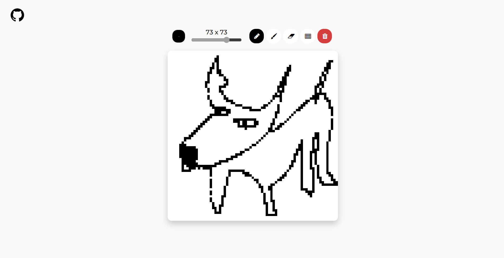

# Etch-A-Sketch
The Odin Project - Foundations Course Project 4:

Developing a browser version of Etch-A-Sketch/Sketchpad using Javascript for DOM manipulation + logic and HTML/CSS for UI.

## Preview

## Links
Live Link: https://luciavu.github.io/etch-a-sketch/

Assignment: https://www.theodinproject.com/lessons/foundations-etch-a-sketch